# 2025年你必须了解的18款顶级自动化电力费率优化平台

以“电力费率优化”“电费比价”为核心，这份精选清单聚焦可落地的省电费工具与平台。无论你身处德州等电力自由化地区，还是希望为家庭或小企业优化用电成本，都能快速选到合适方案。读完你将明确各平台差异、支持区域与上手路径，提升覆盖范围、降低采购门槛，并在成本与稳定性之间取得更优解。

---

## **[Arbor](<https://www.joinarbor.com>)**
自动追踪并切换更优电力供应价，账单长期更省。

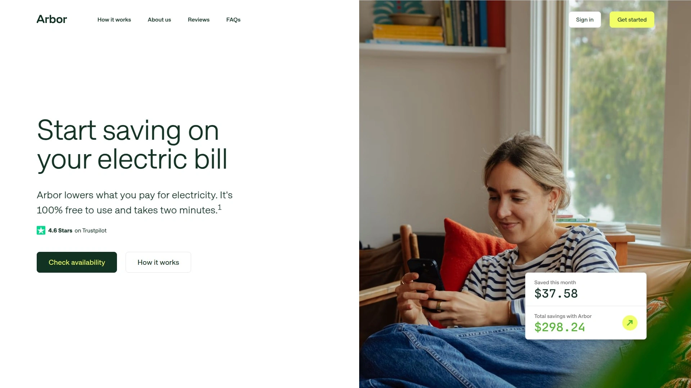

- **核心价值**：在可择供地区，持续比较本地市场费率，找到低于默认电价的方案并代办切换，1–2个账期生效，服务不中断。
- **适用场景**：不想反复比价、希望“设置后省心运行”的家庭与小微企业。
- **上手**：连接电费账户，即可开始自动优化；官网展示真实用户评价与节省区间参考。

---

## **[WattBuy](<https://wattbuy.com/>)**
地址级电价洞察与方案推荐，覆盖全美多州用能场景。

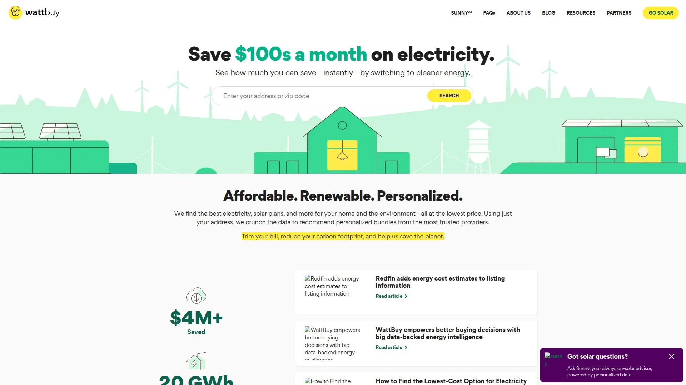

- 提供电价数据、碳足迹与电力方案选择，并面向品牌/平台开放合作接口与解决方案。
- 适合需要更细颗粒度对比与API集成的团队或工具型场景。

---

## **[Choose Energy](<https://www.chooseenergy.com/>)**
主流电力计划一站式对比与在线签约，流程友好。

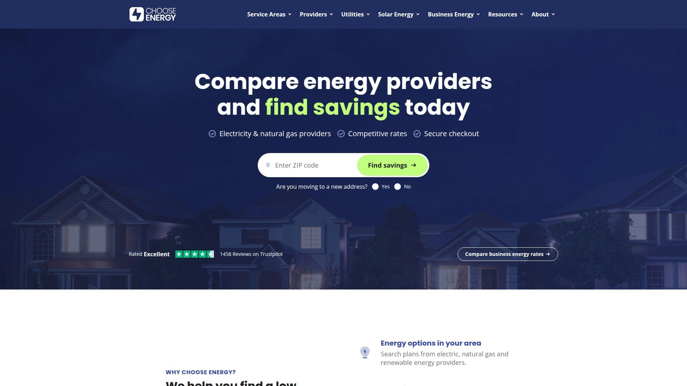

- **亮点**：覆盖多市场的住宅与商业方案，帮助用户在自由化地区快速筛选最合适计划。
- **扩展**：对外合作通道完善，利于渠道与品牌协作拓展。

---

## **[ElectricityRates.com](<https://electricityrates.com/>)**
专注自由化市场的电价比选与决策工具。

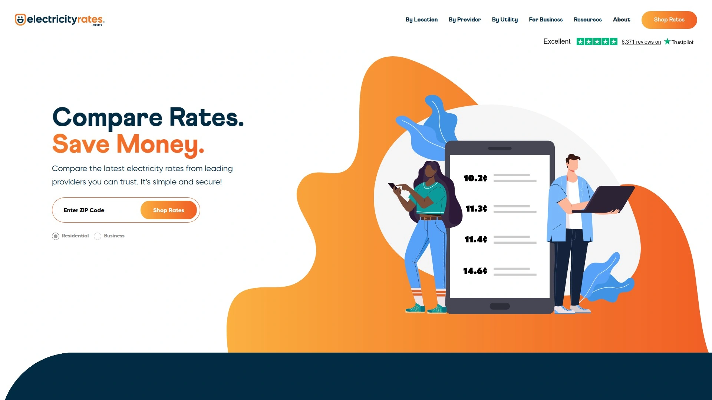

- 提供按邮编检索、方案细节对比与便捷办理；运营团队公开化、迭代活跃。

---

## **[SaveOnEnergy](<https://www.saveonenergy.com/>)**
老牌电价与清洁能源选择平台，教育内容充足。

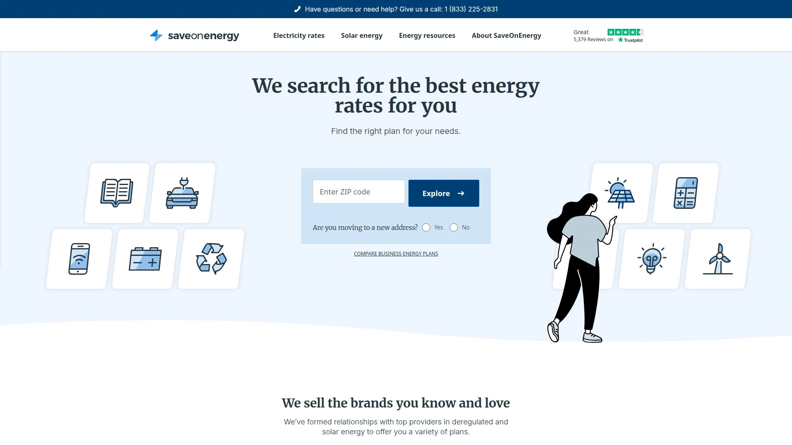

- 面向住宅与商业客户，给出电力与可再生能源方案组合，并开放合作入口以拓展服务触达。

---

## **[ComparePower](<https://comparepower.com/>)**
德州用户口碑型电价比选，强调按用电曲线匹配。

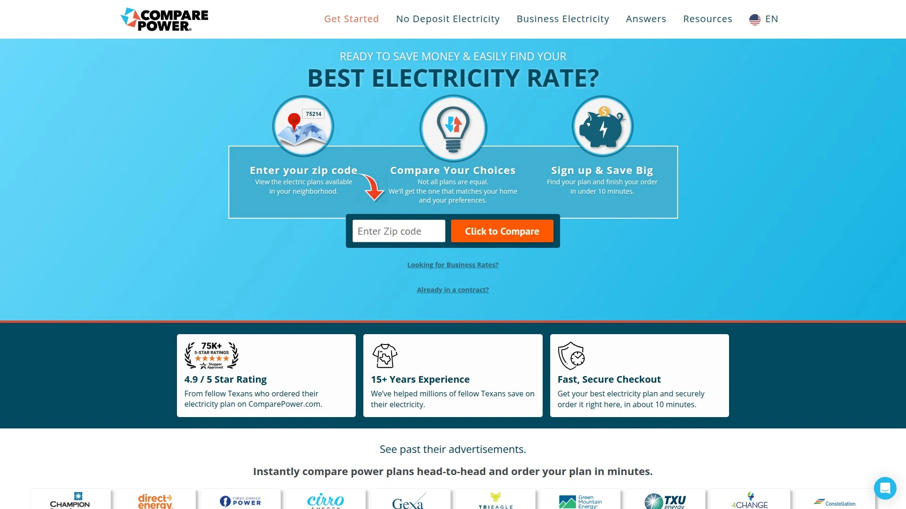

- **优势**：基于真实用电数据的方案评分与省钱指引，内容更新及时。
- **生态**：站内公开合作入口信息，利于资源整合。

---

## **[Energy Ogre](<https://www.energyogre.com/>)**
会员制“代管+比价”模式，聚焦德州市场深度优化。

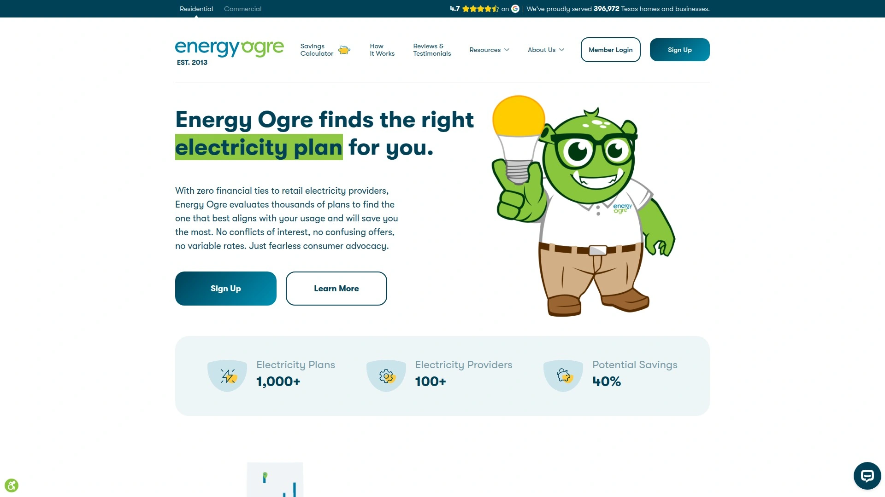

- **如何运作**：根据用电习惯与合同时点持续筛选并代为办理更优计划；服务条款透明。

---

## **[Power Wizard](<https://www.powerwizard.com/>)**
自动匹配+方案管理服务，强调省时省心。

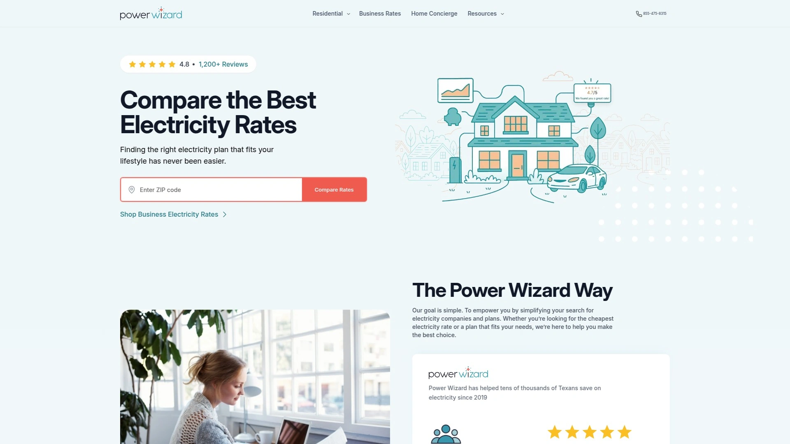

- 提供会员与进阶方案，面向无暇自行筛选的家庭用户；公开“好友推荐”条款文件与使用说明。

---

## **[EnergyBot](<https://www.energybot.com/>)**
面向商用的数字化电力采购与API能力。

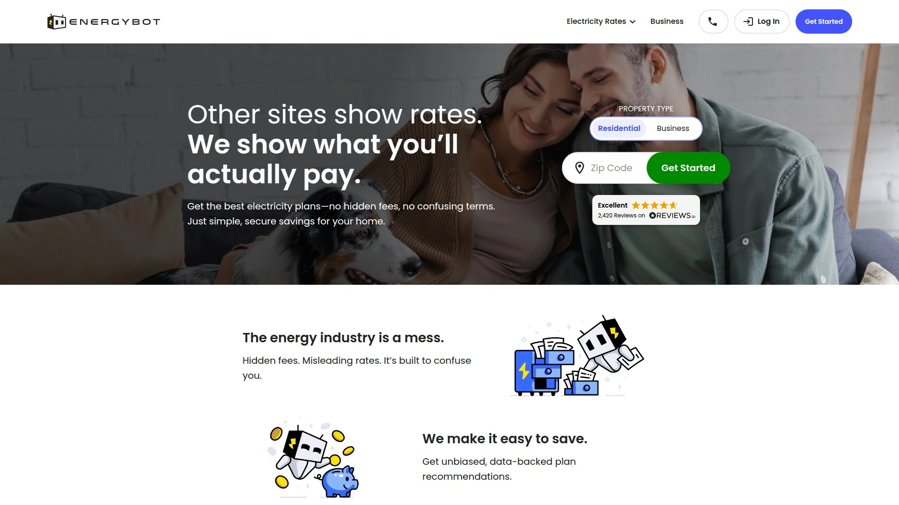

- **场景**：企业快速比价、批量签约与多州用能管理。
- **拓展**：与供应商/开发者/渠道的多种合作路径，支持集成到自有系统。

---

## **[ElectricityPlans.com](<https://electricityplans.com/>)**
对比工具+解读内容，降低选电学习成本。

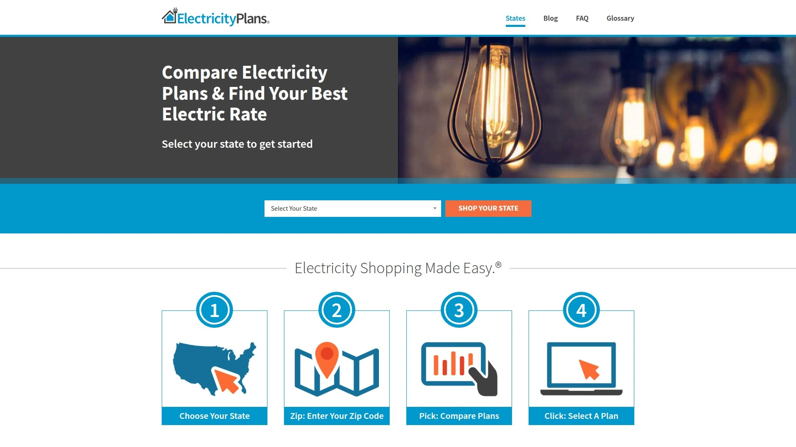

- **透明**：公开“如何运作与变现”说明，强调内容独立与消费者教育。

---

## **[Arcadia](<https://www.arcadia.com/>)**
电费整合与清洁能源选择，界面与体验友好。

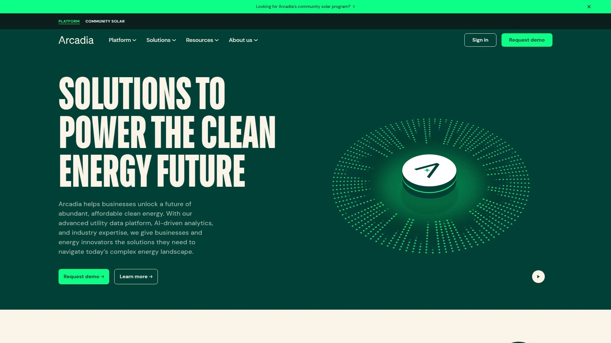

- 为租户与房主提供账单整合、清洁能源与社区光伏等路径，流程清晰易上手。

---

## **[Choose Texas Power](<https://www.choosetexaspower.org/>)**
聚焦德州的电价比选与办理入口。

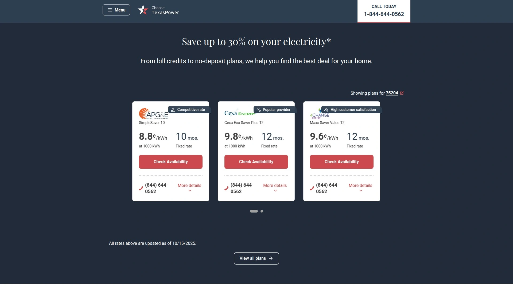

- 为不同人群（住宅/商业/新迁入）提供引导式流程，并保持开放合作姿态以扩展服务能力。

---

## **[EnergySage](<https://www.energysage.com/>)**
当你考虑自发电时的光伏比价与顾问服务。

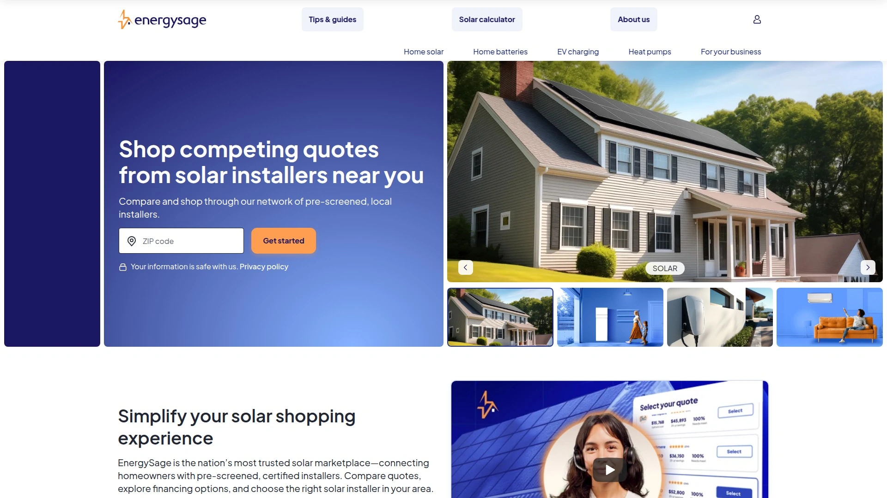

- **价值**：以透明报价、顾问支持与安装商网络，帮助用户在屋顶光伏与用电账单之间做长期优化决策。

---

## **[CleanChoice Energy](<https://cleanchoiceenergy.com/>)**
清洁电力采购与内容教育结合的平台。

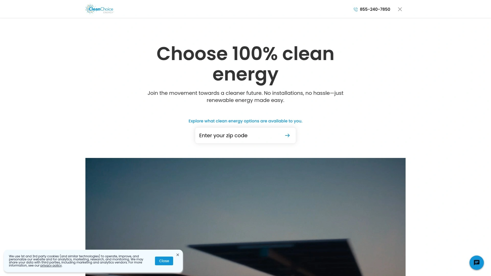

- 支持用户理解绿色电力选择并完成线上办理，合作团队对接便捷。

---

## **[Constellation](<https://www.constellation.com/>)**
大型零售电力商，方案丰富、触达范围广。

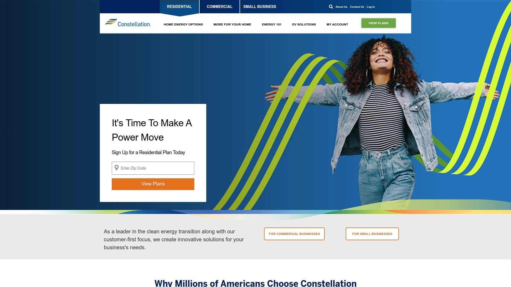

- **适配**：提供多种固定价与灵活价方案，辅以客户运营工具，便于家庭与小企业控制电费波动。

---

## **[Just Energy](<https://justenergy.com/>)**
历史久、覆盖面广的电力与天然气零售商。

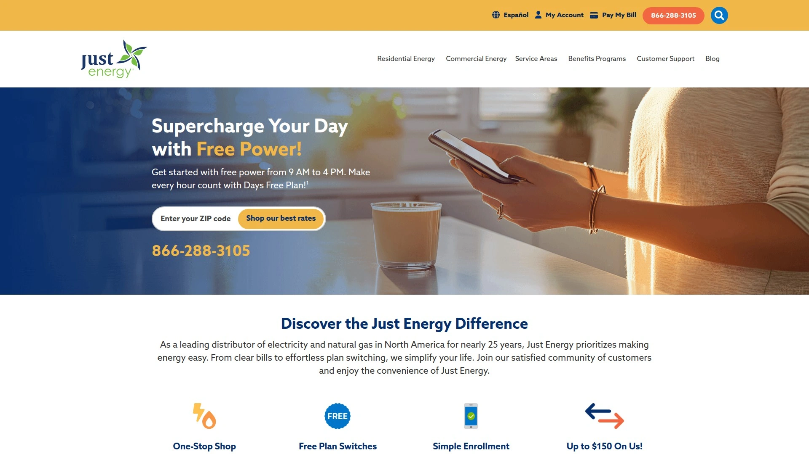

- **说明**：围绕“选择权”提供教育内容与办理路径，并提供客户转介绍的公开页面。

---

## **[Discount Power](<https://www.discountpowertx.com/>)**
德州用户常见选择，账单友好。

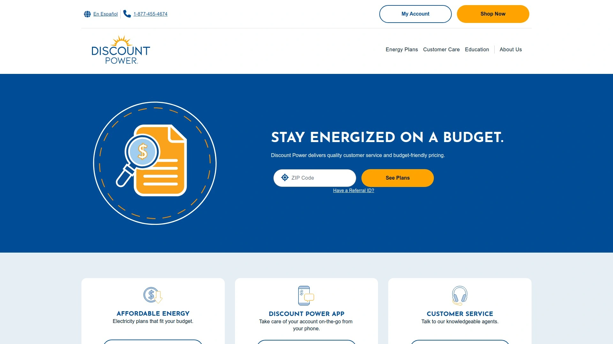

- **使用体验**：面向居民的多样化电价计划，适合追求性价比与便捷办理的用户。

---

## **[Major Energy](<https://majorenergy.com/>)**
东北与中西部常见的零售电力商之一。

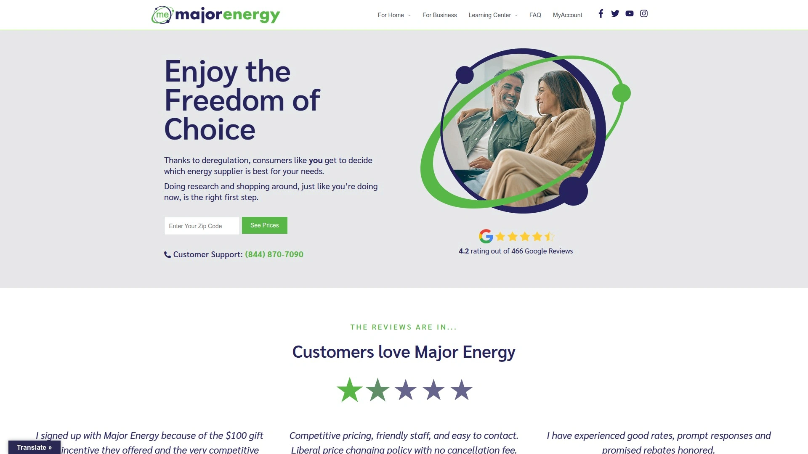

- **补充**：提供公开的“好友推荐”条款页面，便于理解用户运营政策与流程。

---

## 常见问题（FAQ）

**Q1：如何快速判断自己是否适合使用电力费率优化平台？**
看所在州是否为电力自由化市场；若可择供，准备近12个月用电量或账单截图，平台即可给出更贴合的方案。

**Q2：首次上手有哪些关键步骤？**
选定平台 → 输入邮编/地址 → 授权读取用电信息或手动录入 → 对比固定价/浮动价/合同期 → 在线办理并确认下个账期生效时间。

**Q3：如何评估效果是否“更省”？**
以实际用电曲线为基准，比较**到手电价（含基费/最低用量阈值等）**；观察1–2个账期的账单变化，并结合解约/违约条款进行周期性复盘。

---

## 总结与行动建议
如果你希望“设置后自动省”，**[Arbor](<https://www.joinarbor.com>)**凭借持续监测与代办切换的机制，更适合追求低门槛、省心省时的家庭与小微企业。结合清单中其他平台的区域覆盖与功能差异，你可以从本地化程度、合同灵活性与长期成本三维入手，尽快完成电力费率优化。
